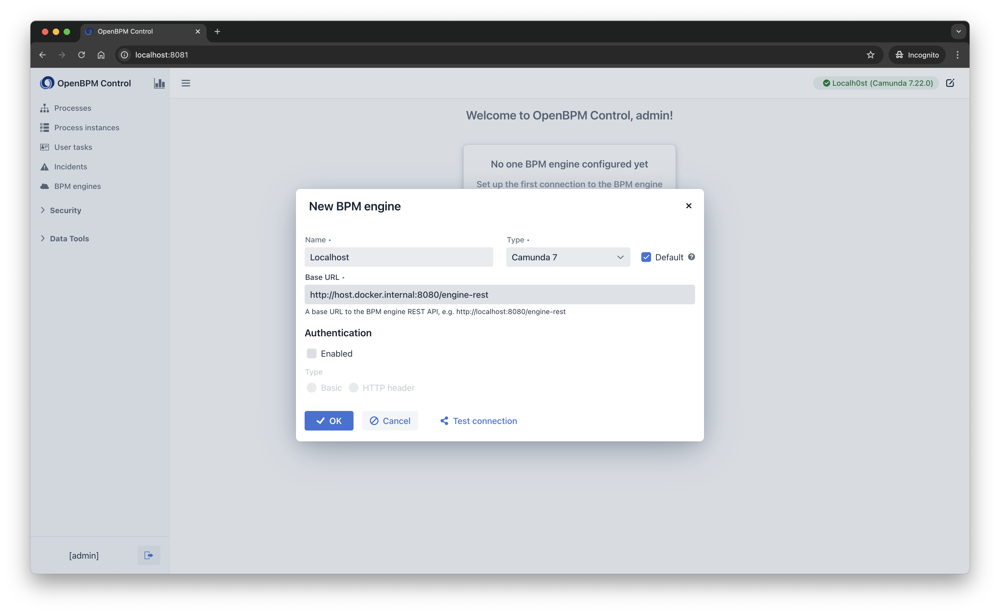
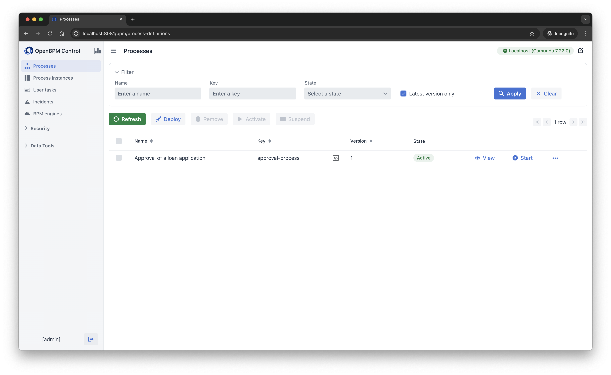
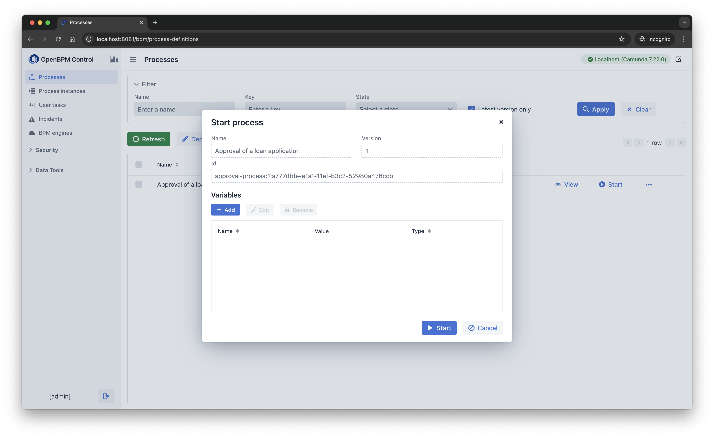
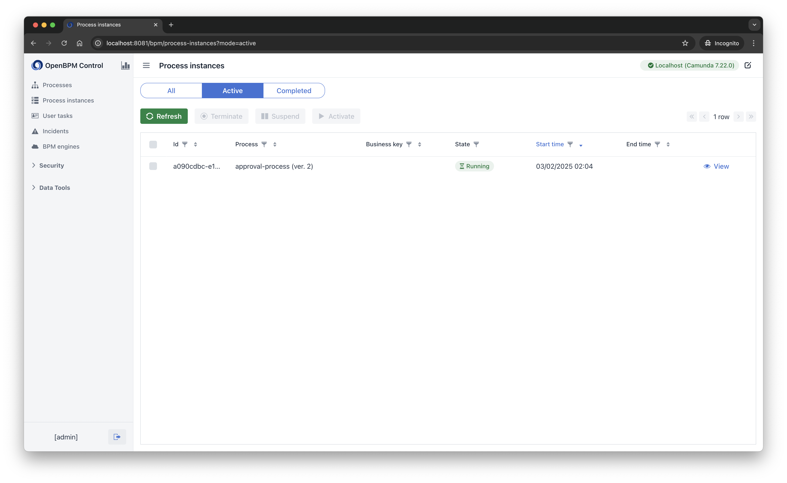
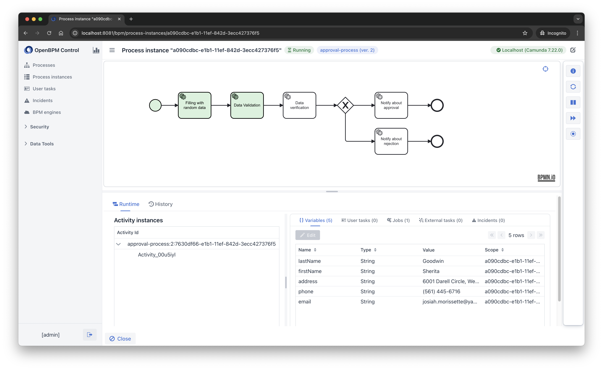

# Credit Application Process Engine

A Spring Boot application with embedded Camunda 7 BPM engine to automate credit application workflows.

---

## 📌 Overview
This project implements a credit application approval process using Camunda 7. The workflow includes:
- Application validation
- Automated credit scoring
- Approval/denial decision routing

**Key Technologies**:
- Spring Boot 3.x
- Camunda 7 BPM Engine
- H2 Database (embedded, for development)

---

## 🚀 Features
- **BPMN 2.0 Workflow**: Visual process design using Camunda Modeler.
- **Automated Credit Scoring**: Integration with mock credit score services.
- **OpenBPM Control**: Monitor business processes.

---

## ⚙️ Prerequisites
- Java 21+
- Gradle
- OpenBPM Studio

---

## 🛠️ Installation

1. **Clone the repository**:
   ```bash
   git clone https://github.com/openbpm-platform/openbpm-spring-boot-sample.git
   cd openbpm-spring-boot-sample

3. **Build and run application**:

    ```bash
    ./gradlew bootRun
    ```

    Note: If you get a permission denied error, first run:
    ```bash
    chmod +x gradlew
    ```

3. **Run OpenBPM Control**

   ```
   cd docker
   docker compose up -d
   ```

4. **Access**:

   Application: http://localhost:8080

   OpenBPM Control: http://localhost:8081

   H2 Console: http://localhost:8080/h2-console (JDBC URL: jdbc:h2:mem:camunda)

## 🔧 Configuration

Update `src/main/resources/application.properties`:

```properties
spring.application.name=openbpm-spring-boot-sample

# H2 Settings
spring.datasource.url: jdbc:h2:file:./h2/camunda-h2-database

spring.h2.console.enabled=true
spring.h2.console.path=/h2-console

#Camunda 7 - embedded configuration
camunda.bpm.admin.user-id=admin
camunda.bpm.admin-user.password=admin

camunda.bpm.auto-deployment-enabled=true
camunda.bpm.deployment-resource-pattern=classpath*:processes/*.bpmn, classpath*:process-forms/*.form

server.port=8080
```

## 📂 Process Definition

A test business process for requesting loan approval has been added to the project.

BPMN File: `src/main/resources/processes/approval-process.bpmn`

### Process Flow:
1. Filling with random data (Service Task):

   Automated generation of test data (first name, last name, phone, email) to simulate a loan application.

2. Data Validation (Service Task):

   Checks data completeness.
   
3. Data Verification (Service Task):

   Decision Logic:
   ➔ Credit score ≥70 → approval.
   ➔ Credit score <70 → rejection.

4. Notify about approval (Service Task):
   
   Automated approval notification

5. Notify about rejection (Service Gateway):

   Automated rejection notification


---

## 🛠 Quick start

### Login

To log in to the applications, take the following steps:

1. Navigate to the http://localhost:8081.
2. Enter the following values
   - Username: **admin**
   - Password: **admin**

### Connecting to BPM Engines
To add a connection to a running BPM engine, follow these steps:

1. Click **Add**.
2. In the **New BPM engine** view, provide the following details:

   - Name: **Localhost**
   - Base URL: http://host.docker.internal:8080/engine-rest
   - Authentication: **false**
   
3. Click the **OK** button to save the connection.



### Starting a Process

To run the test business process, follow these steps

1. Navigate to the **Processes** menu.
2. Click the **Start** button to start the process.





### Managing Process Instances

Once the process has started, go to the **Process Instances** screen.

All business processes running on the engine are displayed here.



Next, click the **View** button, a screen will open to view the status of the process.



You can find a more detailed description about OpenBPM Control [here](https://github.com/openbpm-platform/openbpm-control/blob/main/README.md).

---

## 📊 Monitoring

### OpenBPM Control:

URL: http://localhost:8081/

Analyze process metrics and debug executions.